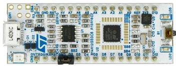

# A repo for 4 DOF robot arm

This is a part of my Graduation project (Research and design of mobile robot for room cleaning).
In this project, I use a nucleo STM32L432KCU6 board to control a 4 DOF robot arm.

* Devices:
  * Nucleo board
  * VL53L1X module (I2C)
  * Hiwonder bus servos: 1 × HX-06L, 1 × LX-225, 2 × LX-15D, 1 × MG90S for robot arm and gripper
* CP2102 module UART to communicate with Raspberry
* Control board (UART half duplex) for bus servo
* Forward/Inverse Kinematics of 4 DOF robot arm
* [Watch result here](https://www.youtube.com/watch?v=gQMT6rC0Xig)

